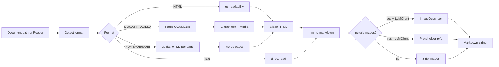

# go-markitdown SPEC

**Status:** Proposed
**Created:** 2026-04-22
**Authors:** Ratpup (roelfdiedericks) + RoDent (goclaw agent)
**License:** AGPL-3.0 (inherited from MuPDF)

## Overview

`go-markitdown` is a Go library and companion CLI for extracting clean, LLM-ready
markdown from common document formats. It is spiritually similar to Microsoft's
Python [`markitdown`](https://github.com/microsoft/markitdown) project, but
native to Go and designed to embed cleanly into other Go applications.

Primary shapes:

- **Library** (`github.com/roelfdiedericks/go-markitdown`) — import the `docconv`
  package into any Go project that needs document-to-markdown conversion.
- **CLI** (`go-markitdown`) — standalone binary for scripts, pipelines, and
  ad-hoc use without writing Go code.

The first consumer is [goclaw](https://github.com/roelfdiedericks/goclaw), which
needs to feed documents (PDFs, Office files, EPUBs, etc.) into LLM context as
markdown. The library was deliberately extracted rather than buried inside
goclaw so it can be reused across projects; the CLI extends that reach to any
tooling that can invoke a binary.

## Goals

1. One interface to extract readable markdown from any common document format.
2. Output clean markdown suitable for LLM context and human reading.
3. Minimize external runtime dependencies — prefer one well-chosen CGO library
   (MuPDF via [`go-fitz`](https://github.com/gen2brain/go-fitz)) over many.
4. **Kitchen-sink distribution model**: bundle MuPDF sources into the library
   so consumers don't need system-level packages. Mirror how goclaw bundles
   `whisper.cpp` — the user installs one Go module and gets a working build.
5. Support cross-compilation for the standard modern set: linux/amd64,
   linux/arm64, darwin/amd64, darwin/arm64.
6. Ship both a library and a CLI from the same module.
7. Keep the API small and interface-driven so consumers can wire their own
   image-description (or future OCR) backend without pulling in opinions.

## Non-Goals

- Full document manipulation (editing, creating, pixel-perfect layout
  reproduction).
- Classical OCR engines (Tesseract, PaddleOCR) are not bundled. v0.1 instead
  uses the `ImageDescriber` interface for both embedded-image description
  and LLM-based page transcription via the `OCRFallback` option. See the
  "Image Handling" section below.
- Windows support (not a priority for v1; may land later if demand appears —
  `go-fitz` does support Windows with CGO).
- Plugin architecture. Formats are compiled in; add new formats via PRs, not
  dynamic loading.

## Audience

- **Library consumers:** Go applications that want programmatic extraction.
  Primary: goclaw. Secondary: any Go tooling that needs document-to-markdown.
- **CLI users:** Humans and scripts that want to pipe a document through to
  markdown without a Go build step. Typical usage:
  `go-markitdown convert report.pdf > report.md`.

## Architecture

### Core Library API

Package `docconv` exposes a small, stable surface:

```go
package docconv

import (
    "context"
    "io"
)

// Extract returns markdown-formatted text from any supported document on disk.
func Extract(path string, opts *Options) (string, error)

// ExtractReader extracts from an io.Reader with an explicit format hint.
// Use FormatAuto to request magic-byte detection when reading from a stream
// where the file name is unavailable.
func ExtractReader(r io.Reader, format Format, opts *Options) (string, error)

// Options configures extraction behavior. Nil is treated as the zero value.
type Options struct {
    // LLMClient provides image description capability (optional).
    // If nil, embedded images are referenced but not described.
    LLMClient ImageDescriber

    // IncludeImages controls whether to extract/reference embedded images.
    // - true  + LLMClient != nil: images are described inline
    // - true  + LLMClient == nil: images are referenced as placeholders
    // - false:                    images are omitted entirely
    IncludeImages bool

    // ImageDir is where extracted images are saved (optional).
    // If empty, images are kept in memory only.
    ImageDir string

    // IncludeMetadata, when true, prepends a YAML front-matter block with
    // title / author / page count / creation date where available.
    IncludeMetadata bool

    // OCRFallback enables LLM-based transcription of documents that have no
    // extractable text. Requires LLMClient != nil. Default false; the
    // library returns ErrNoText in that case.
    //
    // When enabled, each page is rendered via go-fitz and fed through
    // LLMClient.DescribeImage with an OCR-style prompt. This is slow and
    // costs API credits, so it is strictly opt-in.
    OCRFallback bool

    // OCRDPI controls the render resolution for OCR fallback pages.
    // Default 200.
    OCRDPI float64

    // DescribePrompt overrides the default prompt used for embedded-image
    // description. Empty means use the library default.
    DescribePrompt string

    // OCRPrompt overrides the default prompt used for OCR fallback pages.
    // Empty means use the library default.
    OCRPrompt string
}

// ImageDescriber describes images for LLM context. Consumers implement this
// with whatever vision model / chain they choose; docconv never imports or
// depends on any specific LLM SDK.
//
// The same interface serves two roles in v0.1:
//   - Inline image description when IncludeImages is true.
//   - Page-level transcription (OCR) when OCRFallback is true and a document
//     has no extractable text.
//
// The library picks a different default prompt for each role and passes it
// as the prompt argument. Implementations can either route on the prompt or
// pass it through to a vision model verbatim.
type ImageDescriber interface {
    DescribeImage(ctx context.Context, img []byte, mimeType string, prompt string) (string, error)
}

// Format represents a document type.
type Format int

const (
    FormatAuto  Format = iota // Detect from magic bytes / extension
    FormatPDF
    FormatDOCX
    FormatXLSX
    FormatPPTX
    FormatEPUB
    FormatMOBI
    FormatHTML
    FormatText
    FormatImage // Pass to multimodal, not extracted here
)

// Detect returns the format of a file based on extension + magic bytes.
func Detect(path string) (Format, error)

// DetectReader returns the format from magic bytes along with a reader that
// replays the peeked bytes (so callers can use the returned reader for
// subsequent extraction without losing data).
func DetectReader(r io.Reader) (Format, io.Reader, error)
```

Errors are typed so callers can route:

```go
var (
    ErrUnsupportedFormat = errors.New("unsupported document format")
    ErrNoText            = errors.New("no extractable text (may be scanned/image)")
    ErrCorruptDocument   = errors.New("document is corrupt or unreadable")
    ErrPasswordProtected = errors.New("document is password protected")
    ErrFitzRequired      = errors.New("go-fitz required for this format")
)
```

### Extraction Pipeline



For structured output we use go-fitz's HTML mode then convert to markdown:

```go
// 1. go-fitz extracts HTML with structure preserved
html, err := doc.HTML(pageNum)

// 2. html-to-markdown converts to clean markdown
converter := md.NewConverter("", true, nil)
markdown, err := converter.ConvertString(html)
```

For simple text extraction (no structure needed) `doc.Text(pageNum)` is
available as a fast path.

### Backend Selection

| Format | Text / Structure Backend | Image Extraction | Notes |
|--------|--------------------------|------------------|-------|
| PDF    | go-fitz (MuPDF) HTML to markdown | Page render only (embedded-asset extraction not exposed by MuPDF) | Best quality text extraction |
| DOCX   | `fumiama/go-docx` AST to semantic HTML to markdown (primary); `go-fitz` (MuPDF) fallback on parse error | fumiama resolves `r:embed` directly from `word/media/` | Structure-preserving: real headings, markdown tables, ordered/bulleted lists, hyperlinks. Styles, numbering, and core metadata are read via a second `zip.Reader` over the same buffered bytes |
| XLSX   | excelize (tables to markdown) | Custom zip walker over `xl/media/` | Tables render as markdown tables; long columns fall back to CSV |
| PPTX   | hand-rolled stdlib-xml walker over `ppt/slides/slide*.xml` (primary); `go-fitz` (MuPDF) fallback on parse error | `internal/ooxml.ParseRels` resolves `r:embed` against each slide's rels part | Slides become `<section>` blocks; title placeholders become `<h2>`. Each slide is prefixed with an `<!-- Slide number: N -->` HTML comment (mirrors Microsoft markitdown's convention) and slides are joined with `---` |
| EPUB   | go-fitz | embedded to image dir | MuPDF native |
| MOBI   | go-fitz | embedded to image dir | MuPDF native |
| HTML   | go-readability to html-to-markdown | inline to placeholder | Clean article extraction |
| Text   | stdlib | none | Direct read |
| Image  | none | none | Returns `ErrUnsupportedFormat`; caller uses multimodal directly |

Fallback semantics: the native DOCX and PPTX parsers route through `go-fitz` only when the primary parse fails (malformed document, `fumiama`'s strict non-`rId` rels rejection, or an empty walk result combined with `OCRFallback=true`). Under `-tags nofitz` the fallback returns `ErrFitzRequired` and callers see the primary parse error surface; DOCX and PPTX still work on well-formed documents because the primary path is pure Go.

#### DOCX structural limitations

`fumiama/go-docx` focuses on the document body and silently drops a handful of side artefacts. The walker inherits those limitations:

- Headers and footers
- Footnotes and endnotes
- Comments and tracked changes
- Tables of contents
- `w:sdt` content controls
- Bookmarks (anchor-only links `[text](#anchor)` degrade to plain text)
- Field codes (date fields, page numbers, merge fields)

All are v0.2-or-later backlog items. v0.1's design decision is that body text, real tables, headings, and hyperlinks dominate the quality signal for LLM context; the above features are uncommon in the documents the first consumer (`goclaw`) sees.

### Image Handling

`go-fitz` can render PDF pages as images but does **not** extract embedded
images (charts, photos in slides) separately. OOXML formats store images in
predictable zip paths (`word/media/`, `ppt/media/`, `xl/media/`), so we handle
those format-by-format.

Output shape with an `ImageDescriber` configured:

```markdown
## Q3 Results


Revenue increased significantly compared to Q2...
```

Output with `IncludeImages=true` but no describer:

```markdown
## Q3 Results


Revenue increased significantly compared to Q2...
```

Output with `IncludeImages=false`: images are stripped cleanly.

#### OCR fallback

When a document yields no extractable text (a scanned PDF, an EPUB that is
really an image wrapper) and the caller has opted in via `OCRFallback=true`
plus an `LLMClient`, the library renders each page via `go-fitz.ImagePNG`
and sends each PNG through `LLMClient.DescribeImage` with an OCR-style
prompt. The same `ImageDescriber` interface that drives embedded-image
description therefore handles OCR — a single adapter covers both roles, and
callers decide per-use whether they want description or transcription.

When `OCRFallback=false` the library returns `ErrNoText` as before and the
caller (typically goclaw) decides whether to fall back to native multimodal
handling.

### Output Format

#### Text Extraction

Clean markdown with light structure, preserved page boundaries where the
source document has them:

```markdown
# Document Title (if detectable)

Page 1 content here...

---

Page 2 content here...
```

#### Tables

Markdown tables when cells fit, CSV fallback when they don't:

```markdown
| Column A | Column B | Column C |
|----------|----------|----------|
| Value 1  | Value 2  | Value 3  |
```

Or:

```
Column A, Column B, Column C
Value 1, Value 2, Value 3
```

#### Metadata

When `Options.IncludeMetadata == true`, prepend YAML front-matter extracted
from the document where available:

```markdown
---
title: Quarterly Report
author: John Doe
pages: 15
created: 2026-01-15
---

# Content starts here...
```

## CLI

The CLI lives in `cmd/go-markitdown/` and compiles to a single static binary
per target platform.

### Usage

```text
go-markitdown convert [flags] <input>           # stdout output
go-markitdown convert [flags] -o <out> <input>  # file output
go-markitdown detect <input>                    # prints detected format + exits
```

### Flags

| Flag                    | Default | Description |
|-------------------------|---------|-------------|
| `-o, --output PATH`     | stdout  | Write markdown to PATH instead of stdout. |
| `--include-images`      | false   | Reference embedded images in the markdown output. |
| `--image-dir PATH`      | (none)  | Extract embedded images to PATH. Implies `--include-images`. |
| `--metadata`            | false   | Prepend YAML front-matter with document metadata. |
| `--format FORMAT`       | auto    | Force a specific format (useful for piped input). |
| `--describer CMD`       | (none)  | Shell command that receives an image on stdin (plus `GO_MARKITDOWN_PROMPT` and `GO_MARKITDOWN_MIME` env vars) and emits a description on stdout. Enables cheap hook-based image description for CLI users without writing Go. |
| `--describer-timeout D` | 60s     | Per-image timeout for the `--describer` command. |
| `--ocr-fallback`        | false   | When text extraction yields nothing, render each page and OCR it via `--describer`. Has no effect without `--describer`. |
| `--ocr-dpi N`           | 200     | Render DPI for OCR fallback pages. |
| `-v, --verbose`         | false   | Log progress to stderr. |
| `--version`             |         | Print version and exit. |

Exit codes: `0` success, `1` extraction error, `2` unsupported format,
`3` invalid arguments.

### Design notes for the CLI

- The CLI never writes to stdout itself when `-o` is set; markdown only goes
  to the requested sink. Logging goes to stderr. This keeps the CLI pipe-safe.
- Reading from stdin is supported: `cat file.pdf | go-markitdown convert -`.
- The `--describer` hook is a deliberate design choice: it lets non-Go users
  bolt a local vision model into the flow without docconv depending on any
  specific LLM SDK. The library interface (`ImageDescriber`) stays clean; the
  CLI wraps it in a subprocess adapter.

## Dependencies

### Required (CGO, bundled)

- [`github.com/gen2brain/go-fitz`](https://github.com/gen2brain/go-fitz) —
  MuPDF wrapper. Handles PDF, DOCX (via MuPDF's office support), EPUB, MOBI,
  and others. **Used in bundled mode**: MuPDF C sources compile with the Go
  build, no system `libmupdf` required.

### Required (Pure Go)

- [`github.com/JohannesKaufmann/html-to-markdown/v2`](https://github.com/JohannesKaufmann/html-to-markdown) — HTML to Markdown conversion.
- [`github.com/xuri/excelize/v2`](https://github.com/xuri/excelize) — XLSX
  table extraction (better quality than MuPDF for spreadsheet tables).
- [`github.com/fumiama/go-docx`](https://github.com/fumiama/go-docx) —
  AGPL-3.0 DOCX reader. Used as the primary DOCX backend to get the
  full `w:document` AST (paragraphs, runs, tables, hyperlinks, inline
  images) without MuPDF's layout-first flattening.
- [`codeberg.org/readeck/go-readability/v2`](https://codeberg.org/readeck/go-readability) — article-style HTML extraction (maintained fork; upstream `go-shiori/go-readability` is deprecated).

### Build Tags

```go
// +build !nofitz

// Default: go-fitz with bundled MuPDF.
func extractPDF(path string) (string, error) {
    doc, err := fitz.New(path)
    // ...
}
```

```go
// +build nofitz

// Pure-Go fallback. PDF, EPUB, and MOBI return ErrFitzRequired; every
// other format (DOCX, PPTX, XLSX, HTML, text) works without CGO thanks
// to the native structure-preserving parsers.
func extractPDF(path string) (string, error) {
    return "", ErrFitzRequired
}
```

The `nofitz` tag is kept for environments where CGO is genuinely unavailable
(wasm, constrained containers). It is **not** the recommended build, but the
only formats that degrade are PDF, EPUB, and MOBI — everything else still
produces structure-preserving markdown.

## Build & Distribution

### Bundled MuPDF (default)

`go-fitz` compiles MuPDF from vendored C sources as part of `go build` when
`CGO_ENABLED=1`. First build takes roughly 30 to 60 seconds while MuPDF
compiles; subsequent builds are cached.

```bash
# Library: standard go install path.
go install github.com/roelfdiedericks/go-markitdown/cmd/go-markitdown@latest

# From source:
git clone https://github.com/roelfdiedericks/go-markitdown
cd go-markitdown
go build ./cmd/go-markitdown
```

No `apt install libmupdf-dev`. No `brew install mupdf`. No custom CGO flags in
a Makefile. This is the "kitchen sink" model the goclaw project prefers and
mirrors how goclaw bundles `whisper.cpp`.

### Cross-Compilation Matrix

| GOOS    | GOARCH | Status |
|---------|--------|--------|
| linux   | amd64  | Primary. CI release target. |
| linux   | arm64  | Primary. CI release target. |
| darwin  | amd64  | Primary. CI release target. |
| darwin  | arm64  | Primary. CI release target. |
| windows | any    | Unsupported in v1. |

Cross-compilation uses a CGO-enabled cross-toolchain (e.g. `zig cc` or the
standard apple-clang / gcc matrix). The CI release pipeline produces four
pre-built binaries per release, mirroring goclaw's release matrix.

### Without CGO (degraded)

```bash
CGO_ENABLED=0 go build -tags "nofitz" ./...
```

Supports HTML, plain text, and pure-Go XLSX only. Provided as an escape hatch
for environments that genuinely cannot run CGO.

## Integration: goclaw

goclaw is the first consumer. Relevant integration points:

- Uploaded documents arriving via Telegram/HTTP/MCP channels are saved to
  `media/uploads/`, then `docconv.Extract()` is called and the resulting
  markdown is injected into LLM context.
- goclaw supplies an `ImageDescriber` implementation backed by whatever
  vision-capable model the operator has configured (local llama.cpp vision,
  or a cloud endpoint). docconv never imports goclaw's LLM code.
- For images or scanned PDFs where no text is extractable, `docconv.Extract()`
  returns `ErrNoText` and goclaw falls back to native multimodal handling.

Integration sketch:

```go
if isDocument(path) {
    text, err := docconv.Extract(path, &docconv.Options{
        IncludeImages: true,
        LLMClient:     goclawVisionAdapter{},
    })
    switch {
    case errors.Is(err, docconv.ErrNoText):
        return fallbackToMultimodal(path)
    case err != nil:
        return err
    }
    return text, nil
}
```

## Licensing

- `go-fitz`: AGPL-3.0
- MuPDF (bundled via go-fitz): AGPL-3.0
- `excelize`: BSD-3-Clause
- `go-readability`: MIT
- `html-to-markdown/v2`: MIT

Because the library links MuPDF (AGPL) and is itself published as an AGPL
package, downstream users that link `go-markitdown` into **distributed**
software must comply with AGPL obligations (source availability including any
modifications, and source availability for network-accessed services). Local
and internal use is unaffected.

Commercial MuPDF licensing is available from Artifex for consumers that need
to avoid AGPL — that is a concern for those consumers, not this library.

## Versioning

- Semantic versioning. Pre-1.0 while the API stabilizes; breaking changes
  bumped via minor-version bumps during 0.x.
- Tag releases with `vX.Y.Z`. CI builds CLI binaries and attaches them to the
  GitHub release.
- The library and CLI share a single version; there is no separate CLI
  version track.

## Roadmap

### v0.1 (initial release)

- Library API as specified above, including `OCRFallback`, `OCRDPI`, and
  custom prompt overrides.
- CLI with `convert` and `detect` subcommands, `--describer`,
  `--describer-timeout`, `--ocr-fallback`, `--ocr-dpi`.
- PDF, DOCX, XLSX, PPTX, EPUB, MOBI, HTML, text support.
- Cross-compiled binaries for linux/darwin x amd64/arm64.
- Basic test corpus and CI.
- `examples/describer-anthropic.sh` — reference `--describer` hook using the
  Anthropic Messages API, for quick end-to-end validation.

### v0.2 (nice-to-have)

- Metadata extraction for all supported formats (currently strongest on PDF
  via MuPDF).
- Better table-handling heuristics for XLSX (merged cells, frozen panes).
- In-document-order image placement for OOXML (v0.1 appends images in a
  dedicated "Images" section rather than inline).

### v0.3 (classical OCR backends)

Optional adapters for Tesseract / PaddleOCR / cloud OCR services that
implement the existing `ImageDescriber` interface. The library's OCR path
already flows through `ImageDescriber`, so these simply become alternative
implementations. No new interface needed.

### v0.4 (structured extraction)

```go
type Document struct {
    Title    string
    Sections []Section
    Tables   []Table
    Images   []ImageRef
}

func ExtractStructured(path string, opts *Options) (*Document, error)
```

Useful for callers that want to do their own downstream shaping rather than
consume the markdown string.

## Open Questions / Risks

- **First-build time (~30 to 60s for MuPDF compile)** is a user-experience
  cost. Mitigation: document it prominently in the README and rely on the
  go build cache for subsequent builds.
- **AGPL reach** may surprise consumers who didn't realise linking MuPDF
  triggers AGPL on their output. Mitigation: README callout, `LICENSE` at
  repo root, NOTICE file listing transitive AGPL.
- **OOXML edge cases** (heavily styled DOCX, pivot tables in XLSX) may need
  format-specific heuristics beyond what MuPDF produces. Accepted as
  incremental work; v0.1 aims for "good enough for LLM context" rather than
  "lossless".
- **`html-to-markdown/v2` output quality** varies with input HTML structure.
  A small golden-file test corpus will catch regressions as we tune the
  pipeline.

## References

- [Microsoft markitdown](https://github.com/microsoft/markitdown) — Python equivalent that inspired the name.
- [go-fitz](https://github.com/gen2brain/go-fitz) — MuPDF Go wrapper.
- [MuPDF](https://mupdf.com/) — underlying C library.
- [go-pdfium](https://github.com/klippa-app/go-pdfium) — Apache-2.0 PDF alternative, considered and declined for v1 because it is PDF-only.
- [html-to-markdown](https://github.com/JohannesKaufmann/html-to-markdown) — HTML-to-markdown converter.
- [excelize](https://github.com/xuri/excelize) — pure-Go XLSX reader.
- [go-readability (readeck fork)](https://codeberg.org/readeck/go-readability) — article-style HTML cleanup (maintained replacement for the deprecated go-shiori/go-readability).
- [goclaw](https://github.com/roelfdiedericks/goclaw) — primary consumer project.
